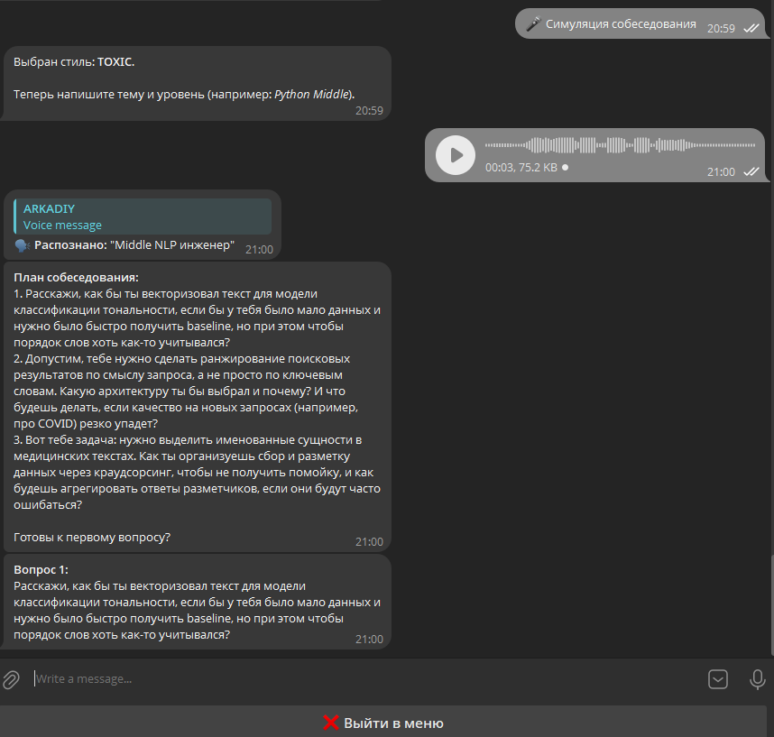
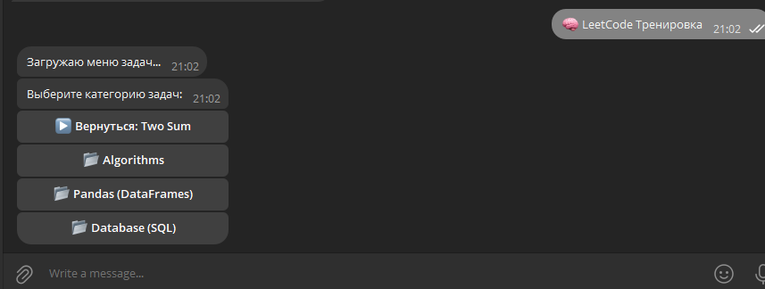
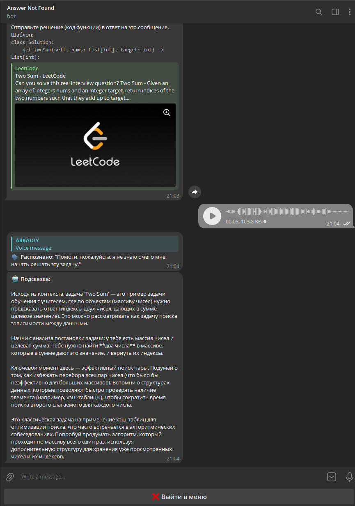
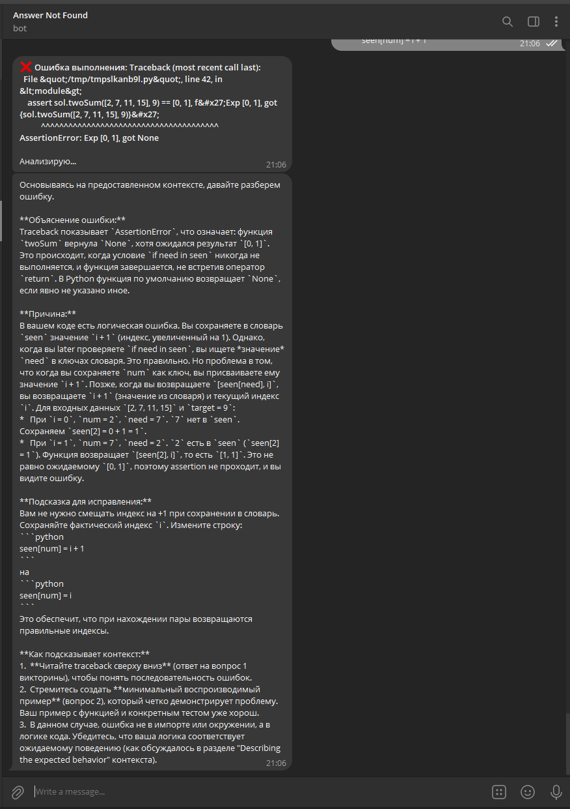
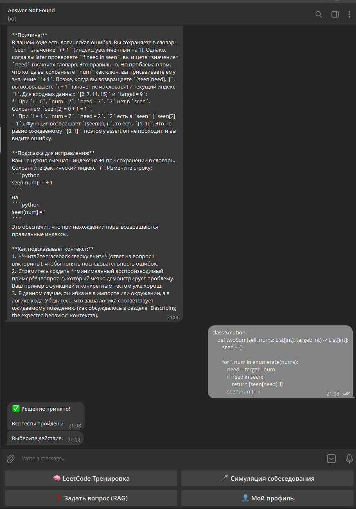
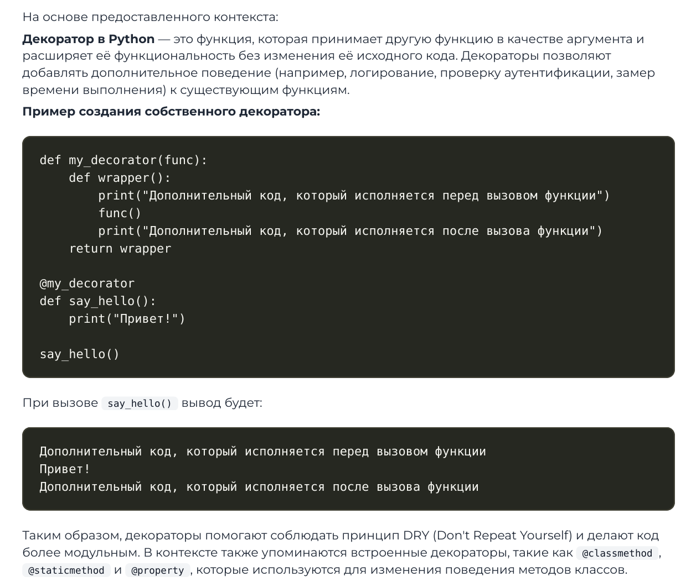

# Interview Assistant

Ассистент для подготовки к техническим собеседованиям. Проект реализован на микросервисной архитектуре и объединяет возможности RAG, симуляцию собеседований и выполнение кода


## Возможности

*   **🧠 LeetCode Тренажер:**
    *   Получение реальных задач с LeetCode (через GraphQL API)
    *   **Sandboxed Execution:** Безопасный запуск Python-кода пользователя с проверкой на unit-тестах, сгенерированных LLM
    *   Анализ ошибок: Если код падает, AI объясняет причину (Traceback analysis) и дает подсказку, не раскрывая решения
*   **🎤 Симуляция Интервью:**
    *   Голосовой режим: Общение с ботом через голосовые сообщения (STT через Deepgram)
    *   Персоны: Выбор стиля интервьюера ("Доброжелательный HR", "Технический Гик", "Токсичный Лид")
    *   Динамический план собеседования под стек пользователя
*   **📚 База знаний (RAG):**
    *   Ответы на теоретические вопросы с использованием векторного поиска по документации
    *   Экспорт переписки и объяснений в PDF
*   **👤 Профиль и Аналитика:**
    *   Система рангов (Junior -> Tech Lead)
    *   Скрытый психологический портрет пользователя, который обновляется по мере общения

## Демонстарция

### 1. Начало работы и Профиль
Главное меню, онбординг и геймифицированный профиль со "скрытым" портретом кандидата

| Главное Меню | Профиль Кандидата |
|:---:|:---:|
|  |  |

### 2. Симуляция собеседования
Выбор персоны "Токсик", генерация плана вопросов и общение голосом

| Выбор Персоны | Голосовой ответ |
|:---:|:---:|
|  |  |

### 3. LeetCode: Выбор и Подсказки
Навигация по категориям, получение задачи и умные подсказки через RAG, если пользователь застрял

| Выбор Задачи | Условие и Подсказка |
|:---:|:---:|
|  |  |

### 4. LeetCode: Выполнение кода и Ошибки
Цикл отладки: отправка неправильного кода -> получение объяснения ошибки -> отправка исправленного решения

| Ошибка Runtime | Анализ ошибки AI | Успешное решение |
|:---:|:---:|:---:|
|  |  |  |

### 5. Ответы на базе RAG
Ответы на теоретические вопросы с контекстом и генерация PDF

| Ответ RAG | Экспорт PDF |
|:---:|:---:|
|  |  |


---

# Архитектура

Система построена на микросервисной архитектуре с использованием Docker Compose. Ключевой особенностью является **двухступенчатый RAG (Retrieval Augmented Generation)** с использованием локальных LLM для эмбеддинга и реранкинга, развернутых через vLLM

### Компоненты системы

#### 1. Core Services
*   **Telegram Bot:** Фронтенд системы. Реализует логику меню, обработку файлов и middleware для голосовых сообщений
*   **Chat Service (FastAPI + LangGraph):** Оркестратор диалога. Управляет состоянием (StateGraph), формирует промпты и обращается к RAG
*   **Redis:** Единая шина данных (FSM Storage для бота, LangGraph Checkpoints для истории диалога, кэш профилей, очереди задач и метрики)

#### 2. Advanced RAG Infrastructure
Реализован сложный пайплайн поиска для повышения точности ответов

*   **DB Service (FastAPI):**
    *   Прослойка для управления поиском
    *   Реализует методы `/add_chunks` (индексация) и `/retrieve` (поиск)
*   **Embedding Service (vLLM):**
    *   Сервер совместимый с OpenAI API
    *   Модель: **Qwen3-Embedding-8B**
    *   Конфигурация: Оптимизированный KV-кэш, использование GPU
*   **Weaviate Vector DB:**
    *   Persistent хранилище векторов
    *   Настроена схема данных `doc` для хранения текстовых чанков и их векторов
*   **Reranking Service (vLLM):**
    *   Сервер совместимый с OpenAI API
    *   Модель: **Qwen3-Reranker-8B**.
    *   Задача: Пересортировка (rescoring) кандидатов, найденных в Weaviate, для отбора top-k наиболее релевантных контексту

#### 3. Auxiliary Services
*   **LeetCode Service:**
    *   Взаимодействие с GraphQL API LeetCode
    *   **Sandboxed Execution:** Изолированный запуск Python-кода через `asyncio.subprocess` с лимитами по памяти и времени
    *   Предварительный статический анализ кода (AST) для отлова синтаксических ошибок
*   **Transcribe Service:**
    *   Микросервис-обертка над Deepgram API
    *   Конвертация OGG -> MP3 -> Текст
    *   Модель: `nova-2`

### Детали реализации RAG

Процесс обработки запроса пользователя (Retrieval Flow):

1.  **Vector Search:** Запрос пользователя векторизуется через *Embedding Service*
2.  **Candidate Generation:** Из *Weaviate* извлекается широкий список кандидатов (топ 30) по косинусному сходству
3.  **Reranking:** Список кандидатов и исходный запрос отправляются в *Reranking Service*. Тяжелая модель сравнивает семантическую близость запроса и каждого документа
4.  **Selection:** Отбираются топ 5 документов с наивысшим Score
5.  **Generation:** Документы подаются в контекст LLM для генерации финального ответа

**Конфигурация vLLM:**
Для обеспечения производительности модели запускаются с параметрами:
*   `--kv-cache-type`: fp8 (для экономии памяти)
*   `--max-num-seqs`: оптимизировано под батчинг запросов
*   `--gpu-memory-utilization`: 0.9

---

### Обновленная инструкция по запуску (Полный стек)

Чтобы поднять полную инфраструктуру с локальными моделями требуется GPU с ~24GB VRAM:

```bash
# Запуск RAG инфраструктуры (Weaviate + vLLM Models)
docker-compose -f src/docker-compose.RAG.yml up -d
```

Основыне сервисы запускаются отдельно:

```bash
#  Запуск основных сервисов приложения
docker-compose -f src/docker-compose.yml up -d
```

### Метрики и Тестирование

#### Результаты оценки RAG (RAGAS)
Оценка произведена на выборке из 30 запросов. 
*Подробные результаты доступны в файле:* [rag_llm_eval.json](evaluation_results/rag_llm_eval.json)

| Metric | Score |
|:---|:---|
| **Faithfulness** | 0.5725 |
| **Answer Relevancy** | 0.7888 |
| **Context Precision** | 0.2501 |
| **Context Recall** | 0.2782 |

#### Live Performance Metrics (Last 100 requests)
Средние показатели системы (с учетом локальных RAG моделей):

*   **Chat Response:**
    *   Avg: 51.214s
    *   Min: 25.260s
    *   Max: 60.708s
*   **Voice Transcribe:**
    *   Avg: 2.262s
*   **Code Execution:**
    *   Avg: 0.070s